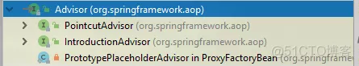
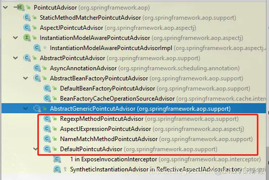
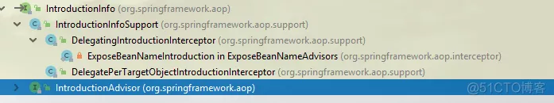
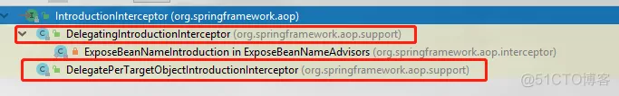

**Advisor、PointcutAdvisor、IntroductionAdvisor、IntroductionInterceptor（引介增强）**

`Advisor`是Spring AOP的顶层抽象，用来管理`Advice`和`Pointcut`（PointcutAdvisor和切点有关，但IntroductionAdvisor和切点无关）

> 注意：Advice是aopalliance对通知（增强器）的顶层抽象，请注意区分~~
> Pointcut是Spring AOP对切点的抽象。切点的实现方式有多种，其中一种就是AspectJ

```java
public interface Advisor {
    //@since 5.0 Spring5以后才有的  空通知  一般当作默认值
    Advice EMPTY_ADVICE = new Advice() {};

    // 该Advisor 持有的通知器
    Advice getAdvice();
    // 这个有点意思：Spring所有的实现类都是return true(官方说暂时还没有应用到)
    // 注意：生成的Advisor是单例还是多例不由isPerInstance()的返回结果决定，而由自己在定义bean的时候控制
    // 理解：和类共享（per-class）或基于实例（per-instance）相关  类共享：类比静态变量   实例共享：类比实例变量
    boolean isPerInstance();
}
```


它的继承体系主要有如下两个：`PointcutAdvisor`和`IntroductionAdvisor`



> `IntroductionAdvisor`与`PointcutAdvisor`上的区别就是，`IntroductionAdvisor`只能应用于类级别的拦截，只能使用Introduction型的Advice。
> 而不能像`PointcutAdvisor`使用任何类型的Pointcut，以及几乎任何类型的Advice。

`PointcutAdvisor`：**和切点有关的Advisor**
顾名思义，它和`Pointcu`有关。

PointcutAdvisor它的实现类非常的多：

```java
public interface PointcutAdvisor extends Advisor {
	Pointcut getPointcut();
}
```



`AbstractPointcutAdvisor`：抽象实现

```java
// 实现了 Ordered接口
public abstract class AbstractPointcutAdvisor implements PointcutAdvisor, Ordered, Serializable {
	// 调用者可以手动来指定Order
	public void setOrder(int order) {
		this.order = order;
	}
	
	@Override
	public int getOrder() {
		if (this.order != null) {
			return this.order;
		}
		
		// 若调用者没有指定Order，那就拿advice的order为准（若有），否则LOWEST_PRECEDENCE表示最后执行
		Advice advice = getAdvice();
		if (advice instanceof Ordered) {
			return ((Ordered) advice).getOrder();
		}
		return Ordered.LOWEST_PRECEDENCE;
	}
	// Spring还没有使用该属性 永远返回true了
	@Override
	public boolean isPerInstance() {
		return true;
	}
	...
}

```
**AbstractGenericPointcutAdvisor 一般的、通用的PointcutAdvisor**

```java
public abstract class AbstractGenericPointcutAdvisor extends AbstractPointcutAdvisor {
	private Advice advice = EMPTY_ADVICE;
	public void setAdvice(Advice advice) {
		this.advice = advice;
	}
	@Override
	public Advice getAdvice() {
		return this.advice;
	}
	...
}
```


**DefaultPointcutAdvisor 通用的，最强大的Advisor**
它是Spring提供的通用的，也被认为是最强大的`Advisor`。它可以把任意的两个Advice和Pointcut放在一起：

```java
public class DefaultPointcutAdvisor extends AbstractGenericPointcutAdvisor implements Serializable {
	private Pointcut pointcut = Pointcut.TRUE;
	public DefaultPointcutAdvisor() {
	}
	// 若没有指定advice,默认Pointcut.TRUE，也就是说会匹配所有的方法的执行
	public DefaultPointcutAdvisor(Advice advice) {
		this(Pointcut.TRUE, advice);
	}
	// 显然，这个构造函数式非常强大的~~
	public DefaultPointcutAdvisor(Pointcut pointcut, Advice advice) {
		this.pointcut = pointcut;
		setAdvice(advice);
	}

}
```


`AbstractBeanFactoryPointcutAdvisor`：**和bean工厂有关的PointcutAdvisor**

```java
// 实现了BeanFactoryAware接口，若在Bean容器里注册可议注入BeanFactory~~~从而访问里面的实例
public abstract class AbstractBeanFactoryPointcutAdvisor extends AbstractPointcutAdvisor implements BeanFactoryAware {
	
	// 我们发现这两个都是@Nullable，所以他们脱离容器使用也是可以的
	@Nullable
	private String adviceBeanName;
	@Nullable
	private BeanFactory beanFactory;
	
	@Nullable
	private transient volatile Advice advice;
	public void setAdviceBeanName(@Nullable String adviceBeanName) {
		this.adviceBeanName = adviceBeanName;
	}
	@Override
	public void setBeanFactory(BeanFactory beanFactory) {
		this.beanFactory = beanFactory;
		// 若在Spring环境下，会给AdviceMonitor重新赋值为：getSingletonMutex()
		resetAdviceMonitor();
	}
	
	// 此处加锁
	public void setAdvice(Advice advice) {
		synchronized (this.adviceMonitor) {
			this.advice = advice;
		}
	}

	// 这是它最重要的方法，获取增强器
	@Override
	public Advice getAdvice() {
		Advice advice = this.advice;
		// 非Spring环境一般手动set进来，所以就直接返回吧
		if (advice != null) {
			return advice;
		}

		// 显然进来Spring容器环境了，bean工厂和beanName都是不能为null的
		Assert.state(this.adviceBeanName != null, "'adviceBeanName' must be specified");
		Assert.state(this.beanFactory != null, "BeanFactory must be set to resolve 'adviceBeanName'");
		
		// 若bean是单例的  那就没什么好说的  直接去工厂里拿出来就完事了（Advice.class）  有可能返回null哦
		if (this.beanFactory.isSingleton(this.adviceBeanName)) {
			advice = this.beanFactory.getBean(this.adviceBeanName, Advice.class);
			this.advice = advice;
			return advice;
		}
		// 若是多例的，就加锁  然后调用getBean()给他生成一个新的实例即可
		else {
			synchronized (this.adviceMonitor) {
				//这步赋值和判断不能省~~~确保万无一失
				advice = this.advice;
				if (advice == null) {
					advice = this.beanFactory.getBean(this.adviceBeanName, Advice.class);
					this.advice = advice;
				}
				return advice;
			}
		}
	}
}
```

`DefaultBeanFactoryPointcutAdvisor`：**通用的BeanFactory的Advisor**

```java
public class DefaultBeanFactoryPointcutAdvisor extends AbstractBeanFactoryPointcutAdvisor {
	private Pointcut pointcut = Pointcut.TRUE;

	// 若传进来为null，还是选择 Pointcut.TRUE 匹配所有
	public void setPointcut(@Nullable Pointcut pointcut) {
		this.pointcut = (pointcut != null ? pointcut : Pointcut.TRUE);
	}
	@Override
	public Pointcut getPointcut() {
		return this.pointcut;
	}
}
```

> 在Spring事务相关里，你会看到这个类

**位于org.springframework.aop.support包内**

`BeanFactoryCacheOperationSourceAdvisor`：和Cache有关

> Spring Cache的@Cachable等注解的拦截，就是采用了它。该类位于：org.springframework.cache.interceptor，显然它和cache相关了。Jar包属于：Spring-context.jar

```java
// @since 3.1  毕竟Spring的整个org.springframework.cache.Cache体系都是从这里开始的。（@Cacheable...等等）
public class BeanFactoryCacheOperationSourceAdvisor extends AbstractBeanFactoryPointcutAdvisor {

	// 显然它最重要的是持有这个引用（Cache章节详细介绍了它）
	@Nullable
	private CacheOperationSource cacheOperationSource;

	// Pointcut使用的是CacheOperationSourcePointcut
	private final CacheOperationSourcePointcut pointcut = new CacheOperationSourcePointcut() {
		@Override
		@Nullable
		protected CacheOperationSource getCacheOperationSource() {
			return cacheOperationSource;
		}
	};


	public void setCacheOperationSource(CacheOperationSource cacheOperationSource) {
		this.cacheOperationSource = cacheOperationSource;
	}
	public void setClassFilter(ClassFilter classFilter) {
		this.pointcut.setClassFilter(classFilter);
	}
	@Override
	public Pointcut getPointcut() {
		return this.pointcut;
	}

}
```

`AsyncAnnotationAdvisor`：**和@Async有关**

> 位于包为：org.springframework.scheduling.annotation，所属jar包为spring-context.jar

```java
public class AsyncAnnotationAdvisor extends AbstractPointcutAdvisor implements BeanFactoryAware {
	// 处理异步发生的异常的====
	private AsyncUncaughtExceptionHandler exceptionHandler;
	
	private Advice advice;
	private Pointcut pointcut;

	// 构造函数们
	public AsyncAnnotationAdvisor() {
		this(null, null);
	}
	// executor：可以自己指定异步任务的执行器
	// exceptionHandler：异步异常的处理器
	public AsyncAnnotationAdvisor(@Nullable Executor executor, @Nullable AsyncUncaughtExceptionHandler exceptionHandler) {
		Set<Class<? extends Annotation>> asyncAnnotationTypes = new LinkedHashSet<>(2);
		asyncAnnotationTypes.add(Async.class);
		
		// 支持EJB的注解：@Asynchronous
		try {
			asyncAnnotationTypes.add((Class<? extends Annotation>)
					ClassUtils.forName("javax.ejb.Asynchronous", AsyncAnnotationAdvisor.class.getClassLoader()));
		} catch (ClassNotFoundException ex) {
			// If EJB 3.1 API not present, simply ignore.
		}
		if (exceptionHandler != null) {
			this.exceptionHandler = exceptionHandler;
		} else {
			// SimpleAsyncUncaughtExceptionHandler：只是一个简单的logger.error的输入打印
			this.exceptionHandler = new SimpleAsyncUncaughtExceptionHandler();
		}
		
		// buildAdvice: new AnnotationAsyncExecutionInterceptor(executor, exceptionHandler)   它是个MethodInterceptor  环绕通知器
		this.advice = buildAdvice(executor, this.exceptionHandler);
		// 把asyncAnnotationTypes交给buildPointcut，它最终是个ComposablePointcut，会把这两种注解都支持。union起来 或者的关系
		this.pointcut = buildPointcut(asyncAnnotationTypes);
	}

	public void setTaskExecutor(Executor executor) {
		this.advice = buildAdvice(executor, this.exceptionHandler);
	}
	...
}
```

`AbstractAspectJAdvice`**的实现类如下：这5个实现类完完整整的对应着我们AspectJ的那5个注解。**

**AspectJPointcutAdvisor**

> 显然是和AspectJ相关的，使用得很是广泛。注意它和AspectJExpressionPointcutAdvisor的区别。有名字也能看出来，AspectJExpressionPointcutAdvisor和表达式语言的切点相关的，而AspectJPointcutAdvisor是无关的。它哥俩都位于包org.springframework.aop.aspectj里。

```java
public class AspectJPointcutAdvisor implements PointcutAdvisor, Ordered {
	
	// AbstractAspectJAdvice通知：它的子类看下面截图，就非常清楚了
	private final AbstractAspectJAdvice advice;
	// 可以接受任意的Pointcut，可谓非常的通用（当然也包含切点表达式啦）
	private final Pointcut pointcut;

	@Nullable
	private Integer order;
	
	// 只有这一个构造函数，包装一个advice
	public AspectJPointcutAdvisor(AbstractAspectJAdvice advice) {
		Assert.notNull(advice, "Advice must not be null");
		this.advice = advice;
		// 然后pointcut根据advice直接给生成了一个。这是AbstractAspectJAdvice#buildSafePointcut的方法
		this.pointcut = advice.buildSafePointcut();
	}

}
```

**InstantiationModelAwarePointcutAdvisor**

> 它是`PointcutAdvisor`的一个子接口。

```java
// 由SpringAOP顾问包装AspectJ实现的接口 可能具有延迟初始化策略的方面。
// 例如，一个PerThis实例化模型意味着对建议的初始化太慢
public interface InstantiationModelAwarePointcutAdvisor extends PointcutAdvisor {

	// 该Advisor是否需要懒加载
	boolean isLazy();
	// 判断此Advisor它所拥有的Advice是否已经初始化了
	boolean isAdviceInstantiated();
}
```

它的唯一实现类：`InstantiationModelAwarePointcutAdvisorImpl`

```java
// 默认的访问权限，显然是Spring内部自己用的
class InstantiationModelAwarePointcutAdvisorImpl
		implements InstantiationModelAwarePointcutAdvisor, AspectJPrecedenceInformation, Serializable {
	private static final Advice EMPTY_ADVICE = new Advice() {};
	// 和AspectJExpression
	private final AspectJExpressionPointcut declaredPointcut;
	..
	
	// 通知方法
	private transient Method aspectJAdviceMethod;
	
	private final AspectJAdvisorFactory aspectJAdvisorFactory;
	private final MetadataAwareAspectInstanceFactory aspectInstanceFactory;

	@Nullable
	private Advice instantiatedAdvice;
	@Nullable
	private Boolean isBeforeAdvice;
	@Nullable
	private Boolean isAfterAdvice;
	
	...
	@Override
	public boolean isPerInstance() {
		return (getAspectMetadata().getAjType().getPerClause().getKind() != PerClauseKind.SINGLETON);
	}
	@Override
	public synchronized Advice getAdvice() {
		if (this.instantiatedAdvice == null) {
			this.instantiatedAdvice = instantiateAdvice(this.declaredPointcut);
		}
		return this.instantiatedAdvice;
	}
	// advice 由aspectJAdvisorFactory去生产  懒加载的效果
	private Advice instantiateAdvice(AspectJExpressionPointcut pointcut) {
		Advice advice = this.aspectJAdvisorFactory.getAdvice(this.aspectJAdviceMethod, pointcut,
				this.aspectInstanceFactory, this.declarationOrder, this.aspectName);
		return (advice != null ? advice : EMPTY_ADVICE);
	}

	@Override
	public boolean isBeforeAdvice() {
		if (this.isBeforeAdvice == null) {
			determineAdviceType();
		}
		return this.isBeforeAdvice;
	}
	@Override
	public boolean isAfterAdvice() {
		if (this.isAfterAdvice == null) {
			determineAdviceType();
		}
		return this.isAfterAdvice;
	}
	
	// 这里解释根据@Aspect方法上标注的注解，来区分这两个字段的值的
	private void determineAdviceType() {
		AspectJAnnotation<?> aspectJAnnotation =
				AbstractAspectJAdvisorFactory.findAspectJAnnotationOnMethod(this.aspectJAdviceMethod);
		if (aspectJAnnotation == null) {
			this.isBeforeAdvice = false;
			this.isAfterAdvice = false;
		}
		else {
			switch (aspectJAnnotation.getAnnotationType()) {
				case AtAfter:
				case AtAfterReturning:
				case AtAfterThrowing:
					this.isAfterAdvice = true;
					this.isBeforeAdvice = false;
					break;
				case AtAround:
				case AtPointcut:
					this.isAfterAdvice = false;
					this.isBeforeAdvice = false;
					break;
				case AtBefore:
					this.isAfterAdvice = false;
					this.isBeforeAdvice = true;
			}
		}
	}
}

```

**这个Advisor是在Spring解析被 @AspectJ注解注释的类时生成的 Advisor**。

而这个`Advisor`中的 `Pointcut`与`Advice`都是由`ReflectiveAspectJAdvisorFactory` 来解析生成的(与之对应的 `Advice` 是 `AspectJMethodBeforeAdvice`, `AspectJAfterAdvice`, `AspectJAfterThrowingAdvice`, `AspectJAroundAdvice`,`Pointcut` 则是`AspectJExpressionPointcut`)， 


解析的步骤是:

自动代理创建器：`AnnotationAwareAspectJAutoProxyCreator.findCandidateAdvisors() `->
Bean工厂相关的Advisor构建器：`BeanFactoryAspectJAdvisorsBuilder.buildAspectJAdvisors() `->
`ReflectiveAspectJAdvisorFactory.getAdvisors()` ->
`ReflectiveAspectJAdvisorFactory.getAdvisor() `最终生成了`InstantiationModelAwarePointcutAdvisorImpl`(当然包括里面的 Pointcut与 advice 也都是由 `ReflectiveAspectJAdvisorFactory` 解析生成的)


**IntroductionAdvisor：引介切面**

Spring中有五种增强：`BeforeAdvide`（前置增强）、`AfterAdvice`（后置增强）、`ThrowsAdvice`（异常增强）、`RoundAdvice`（环绕增强）、`IntroductionAdvice`（引入增强）

> RoundAdvice（环绕增强）：就是BeforeAdvide（前置增强）、AfterAdvice（后置增强）的组合使用叫环绕增强。前四种都比较简单。。。
>

`引入增强（Introduction Advice）的概念：一个Java类，没有实现A接口，在不修改Java类的情况下，使其具备A接口的功能。`

`IntroductionAdvisor`纯粹就是为`Introduction`而生的。

`IntroductionAdvisor` 和 `PointcutAdvisor`接口不同，它仅有一个类过滤器`ClassFilter` 而没有 `MethodMatcher`，这是因为 引介切面 的切点是类级别的，而 Pointcut 的切点是方法级别的（细粒度更细，所以更加常用）。

为了更好的了解`IntroductionAdvisor`，我先有必要讲解下`IntroductionInfo`和`IntroductionInterceptor`；

> Introduction可以在不改动目标类定义的情况下，为目标类增加新的属性和行为。
>

**IntroductionInfo：引介信息**

> IntroductionInfo 接口描述了目标类需要实现的新接口

// 提供描述引言所需信息的接口

```java
// 提供描述引言所需信息的接口
// IntroductionAdvisor必须实现这个接口。若`org.aopalliance.aop.Advice`直接实现了此接口，
// 它可议独立的当作introduction来使用而不用依赖IntroductionAdvisor。这种情况下，这个advice可议自描述，不仅提供。。。
public interface IntroductionInfo {
	//Return the additional interfaces introduced by this Advisor or Advice.
	// 返回额外给Advisor 或者 advice实现的接口们
	Class<?>[] getInterfaces();
}
```


它的继承结构如下：



**IntroductionInterceptor：引介拦截器**

在Spring中，为目标对象`添加新的属性`和行为必须声明相应的接口以及相应的实现。这样，再通过特定的拦截器将新的接口定义以及实现类中的逻辑附加到目标对象上。然后，目标对象（确切的说，是目标对象的代理对象）就拥有了新的状态和行为

这里面介绍这个非常强大的拦截器：IntroductionInterceptor

```java
// IntroductionInterceptor它是对MethodInterceptor的一个扩展，同时他还继承了接口DynamicIntroductionAdvice
public interface IntroductionInterceptor extends MethodInterceptor, DynamicIntroductionAdvice {
	
}
```

`DynamicIntroductionAdvice`:

```java
public interface DynamicIntroductionAdvice extends Advice {
	boolean implementsInterface(Class<?> intf);
}
```

通过`DynamicIntroductionAdvice`，可以界定当前的 `IntroductionInterceptor`为哪些接口提供相应的拦截功能。通过`MethodInterceptor`,`IntroductionInterceptor` 就可以处理新添加的接口上的方法调用了

**打个比方**
如果把每个目标对象实例看作盒装牛奶生产线上的那一盒盒牛奶的话，那么生产合格证就是新的`Introduction`逻辑，而`introductionInterceptor` 就是把这些生产合格证**贴到一盒盒牛奶上的那个人**。

要对目标对象进行拦截并添加`Introduction`的逻辑，我们可以直接扩展`IntroductionInterceptor`，然后在子类的invoke方法中实现所有的拦截逻辑

除非特殊情况下需要直接扩展IntroductionInterceptor,大多数时候，**直接使用Spring提供的两个现成的实现类就可以了**：`DelegatingIntroductionInterceptor` 和 `DelegatePerTargetObjectIntroductionInterceptor`



例子
下面使用一个例子，加深一下对引介增强的了解：

```java
// 定义一个新的行为接口，这个行为准备作用在目标对象上
public interface IOtherInte {
    void doOther();
}
// 自己定义一个IntroductionInterceptor来实现IntroductionInterceptor接口
// 注意：此处也实现了接口IOtherInte（这是类似于增强器部分）  相当于这个interptor目前就只处理 IOtherInte
public class SomeInteIntroductionInterceptor implements IntroductionInterceptor, IOtherInte {
    /**
     * 判断调用的方法是否为指定类中的方法
     * 如果Method代表了一个方法 那么调用它的invoke就相当于执行了它代表的这个方法
     */
    @Override
    public Object invoke(MethodInvocation invocation) throws Throwable {
        if (implementsInterface(invocation.getMethod().getDeclaringClass())) {
            System.out.println("我是引介增强的方法体~~~invoke");
            return invocation.getMethod().invoke(this, invocation.getArguments());
        }
        return invocation.proceed();
    }

    /**
     * 判断clazz是否为给定接口IOtherBean的实现
     */
    @Override
    public boolean implementsInterface(Class clazz) {
        return clazz.isAssignableFrom(IOtherInte.class);
    }

    @Override
    public void doOther() {
        System.out.println("给人贴标签 doOther...");
    }
}

// 方法测试
    public static void main(String[] args) {
        ProxyFactory factory = new ProxyFactory(new Person());
        factory.setProxyTargetClass(true); // 强制私用CGLIB 以保证我们的Person方法也能正常调用

        // 此处采用IntroductionInterceptor 这个引介增强的拦截器
        Advice advice = new SomeInteIntroductionInterceptor();

        // 切点+通知（注意：此处放的是复合切面）
        Advisor advisor = new DefaultIntroductionAdvisor((DynamicIntroductionAdvice) advice, IOtherInte.class);
        //Advisor advisor = new DefaultPointcutAdvisor(cut, advice);
        factory.addAdvisor(advisor);

        IOtherInte otherInte = (IOtherInte) factory.getProxy();
        otherInte.doOther();

        System.out.println("===============================");

        // Person本身自己的方法  也得到了保留
        Person p = (Person) factory.getProxy();
        p.run();
        p.say();
    }

输出：
我是引介增强的方法体~~~invoke
给人贴标签 doOther...
===============================
我在run...
我在say...
```

我们发现，我们没有更改过Person类的任何代码，它竟然就有了`doOther()`方法的功能，这就是引介增强的强大功能。此处使用的`Advisor`为`DefaultIntroductionAdvisor`。它也是我们最常用的Advisor:

```java
// 它是一个Advisor，同时也是一个IntroductionInfo 
public interface IntroductionAdvisor extends Advisor, IntroductionInfo {
	
	// 它只有ClassFilter，因为它只能作用在类层面上
	ClassFilter getClassFilter();
	// 判断这些接口，是否真的能够增强。  DynamicIntroductionAdvice#implementsInterface()方法
	void validateInterfaces() throws IllegalArgumentException;

}

// 它直接事IntroductionAdvisor的实现类。同时也是一个ClassFilter
public class DefaultIntroductionAdvisor implements IntroductionAdvisor, ClassFilter, Ordered, Serializable {
	private final Advice advice;

	private final Set<Class<?>> interfaces = new LinkedHashSet<>();
	private int order = Ordered.LOWEST_PRECEDENCE;
    
	// 构造函数们
	public DefaultIntroductionAdvisor(Advice advice) {
		this(advice, (advice instanceof IntroductionInfo ? (IntroductionInfo) advice : null));
	}
	
	// 如果IntroductionInfo 不等于null，就会把接口都add进去/
	// IntroductionInfo 的实现类有常用的：DelegatingIntroductionInterceptor和DelegatePerTargetObjectIntroductionInterceptor
	public DefaultIntroductionAdvisor(Advice advice, @Nullable IntroductionInfo introductionInfo) {
		Assert.notNull(advice, "Advice must not be null");
		this.advice = advice;
		if (introductionInfo != null) {
			Class<?>[] introducedInterfaces = introductionInfo.getInterfaces();
			if (introducedInterfaces.length == 0) {
				throw new IllegalArgumentException("IntroductionAdviceSupport implements no interfaces");
			}
			for (Class<?> ifc : introducedInterfaces) {
				addInterface(ifc);
			}
		}
	}
	
	//当然你也可以不使用IntroductionInfo，而自己手动指定了这个接口
	public DefaultIntroductionAdvisor(DynamicIntroductionAdvice advice, Class<?> intf) {
		Assert.notNull(advice, "Advice must not be null");
		this.advice = advice;
		addInterface(intf);
	}
	...
	@Override
	public void validateInterfaces() throws IllegalArgumentException {
		for (Class<?> ifc : this.interfaces) {
			if (this.advice instanceof DynamicIntroductionAdvice &&
					!((DynamicIntroductionAdvice) this.advice).implementsInterface(ifc)) {
			 throw new IllegalArgumentException("DynamicIntroductionAdvice [" + this.advice + "] " +
					 "does not implement interface [" + ifc.getName() + "] specified for introduction");
			}
		}
	}
	...
	
}
```

**DelegatingIntroductionInterceptor**和**DelegatePerTargetObjectIntroductionInterceptor**
这两个类是 Spring AOP 中为 IntroductionInterceptor 介面所提供的实作类别，我们可以直接继承他俩，然后扩展我们自己的行为状态。

```java
public class DelegatingIntroductionInterceptor extends IntroductionInfoSupport
		implements IntroductionInterceptor {
	
	// 需要被代理的那个对象。因为这个类需要子类继承使用，所以一般都是thid
	@Nullable
	private Object delegate;
	/**
	 * Construct a new DelegatingIntroductionInterceptor.
	 * The delegate will be the subclass, which must implement
	 * additional interfaces.
	 * 访问权限事protected，显然就是说子类必须去继承这个类，然后提供空构造函数。代理类就是this
	 */
	protected DelegatingIntroductionInterceptor() {
		init(this);
	}
	// 当然，你也可以手动指定delegate
	public DelegatingIntroductionInterceptor(Object delegate) {
		init(delegate);
	}
	private void init(Object delegate) {
		Assert.notNull(delegate, "Delegate must not be null");
		this.delegate = delegate;
		implementInterfacesOnObject(delegate);
		
		// 移除调这些内部标记的接口们
		// We don't want to expose the control interface
		suppressInterface(IntroductionInterceptor.class);
		suppressInterface(DynamicIntroductionAdvice.class);
	}
	
	// 如果你要自定义一些行为：比如环绕通知之类的，子类需要复写此方法（否则没有必要了）
	@Override
	@Nullable
	public Object invoke(MethodInvocation mi) throws Throwable {
		// 判断是否是引介增强
		if (isMethodOnIntroducedInterface(mi)) {
			Object retVal = AopUtils.invokeJoinpointUsingReflection(this.delegate, mi.getMethod(), mi.getArguments());

			// 如果返回值就是delegate 本身，那就把本身返回出去
			if (retVal == this.delegate && mi instanceof ProxyMethodInvocation) {
				Object proxy = ((ProxyMethodInvocation) mi).getProxy();
				if (mi.getMethod().getReturnType().isInstance(proxy)) {
					retVal = proxy;
				}
			}
			return retVal;
		}

		return doProceed(mi);
	}
	...
}
```

因此，上面的例子Demo，我用`DelegatingIntroductionInterceptor`改造一下（只需要改造`SomeInteIntroductionInterceptor`即可）：

```java
// 因为我们继承自DelegatingIntroductionInterceptor，所以若我们不做环绕通知个性化，只需要实现接口的方法即可
public class SomeInteIntroductionInterceptor extends DelegatingIntroductionInterceptor implements IOtherInte {

    @Override
    public void doOther() {
        System.out.println("给人贴标签 doOther...");
    }
}
```

**`DelegatePerTargetObjectIntroductionInterceptor`**

与`DelegatingIntroductionInterceptor`不同，`DelegatePerTargetObjectIntroductionInterceptor`会在内部持有一个目标对象**与相应Introduction逻辑实现类之间的映射关系**。

当每个目标对象上的新定义的接口方法被调用的时候，它会拦截这些调用。然后以目标对象实例作为键，到它持有的那个映射关系中取得对应当前目标对象实例的Introduction实现类实例。 使用起来和`DelegatingIntroductionInterceptor`没有太大区别，主要在构造函数上：

```java
1: 可以删除掉SomeInteIntroductionInterceptor类了
2：单独实现引介接口
public class OtherImpl implements IOtherInte {

    @Override
    public void doOther() {
        System.out.println("我是OtherImpl");
    }
}
main方法里修改如下：这样就ok了
Advice advice = new DelegatePerTargetObjectIntroductionInterceptor(OtherImpl.class, IOtherInte.class);
```

