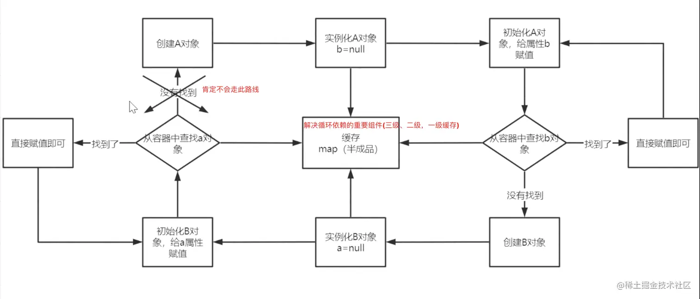

## 扩展点1

###  `实现 ApplicationContextInitializer的initialize方法 `

- ***时机 : spring容器还没被刷新之前 准备阶段 this.prepareContext(context, environment, listeners, applicationArguments, printedBanner); 此时所有的配置文件都已经加载***

```java
java 代码解读复制代码/**
 * ApplicationContextInitializer扩展点演示 时机: spring容器还没被刷新之前
 *
 * <p>
 * 因为这时候spring容器还没被刷新，所以想要自己的扩展的生效，有以下三种方式：
 * <p>
 * 1.在启动类中用springApplication.addInitializers(new ApplicationContextInitializerPoint())语句加入
 * 2.配置文件配置context.initializer.classes=com.xzll.test.ApplicationContextInitializerPoint
 * 3.Spring SPI扩展，在spring.factories中加入org.springframework.context.ApplicationContextInitializer=com.xzll.test.ApplicationContextInitializerPoint
 * <p>
 * //TODO 目前我试了三种方式 只有第二种方式可以输出该类的打印语句 ，1和2都没有输出打印语句 目前不知原因为何。留作以后研究吧
 *
 * 这是整个spring容器在刷新之前初始化ConfigurableApplicationContext的回调接口，简单来说，就是在容器刷新之前调用此类的initialize方法。
 * 这个点允许被用户自己扩展。用户可以在整个spring容器还没被初始化之前做一些事情。
 * 可以想到的场景可能为，在最开始激活一些配置，或者利用这时候class还没被类加载器加载的时机，进行动态字节码注入等操作。
 */
public class ApplicationContextInitializerPoint implements ApplicationContextInitializer<ConfigurableApplicationContext> {

   @Override
   public void initialize(ConfigurableApplicationContext applicationContext) {

      // System.out.println("applicationContext: "+ JSON.toJSONString(applicationContext));
      // 注意这里引入不了FastJson 会报错 AnnotationConfigApplicationContext has not been refreshed yet  ; AnnotationConfigApplicationContext 尚未刷新
      // 详见: https://stackoverflow.com/questions/28404817/annotationconfigapplicationcontext-has-not-been-refreshed-yet-whats-wrong
      System.out.println("------------ApplicationContextInitializerPoint # initialize 开始-------------");
      System.out.println("[ApplicationContextInitializer扩展点演示] # initialize:  " + applicationContext.toString());
      System.out.println("BeanDefinitionCount count: " + applicationContext.getBeanDefinitionCount());
      ConfigurableListableBeanFactory beanFactory = applicationContext.getBeanFactory();
      Iterator<String> beanNamesIterator = beanFactory.getBeanNamesIterator();
      beanNamesIterator.forEachRemaining(System.out::println);
      System.out.println("时机: "+ "run 方法中的 this.prepareContext(); 的时候");
      System.out.println("-------------ApplicationContextInitializerPoint # initialize 结束------------");
      System.out.println();

   }

   /*

   private void prepareContext(ConfigurableApplicationContext context, ConfigurableEnvironment environment, SpringApplicationRunListeners listeners, ApplicationArguments applicationArguments, Banner printedBanner) {
        context.setEnvironment(environment);
        this.postProcessApplicationContext(context);
        this.applyInitializers(context);
        listeners.contextPrepared(context);
        if (this.logStartupInfo) {
            this.logStartupInfo(context.getParent() == null);
            this.logStartupProfileInfo(context);
        }

        ConfigurableListableBeanFactory beanFactory = context.getBeanFactory();
        beanFactory.registerSingleton("springApplicationArguments", applicationArguments);
        if (printedBanner != null) {
            beanFactory.registerSingleton("springBootBanner", printedBanner);
        }

        if (beanFactory instanceof DefaultListableBeanFactory) {
            ((DefaultListableBeanFactory)beanFactory).setAllowBeanDefinitionOverriding(this.allowBeanDefinitionOverriding);
        }

        Set<Object> sources = this.getAllSources();
        Assert.notEmpty(sources, "Sources must not be empty");
        this.load(context, sources.toArray(new Object[0]));
        listeners.contextLoaded(context);
    }


     protected void applyInitializers(ConfigurableApplicationContext context) {
        Iterator var2 = this.getInitializers().iterator();

        while(var2.hasNext()) {
            ApplicationContextInitializer initializer = (ApplicationContextInitializer)var2.next();
            Class<?> requiredType = GenericTypeResolver.resolveTypeArgument(initializer.getClass(), ApplicationContextInitializer.class);
            Assert.isInstanceOf(requiredType, context, "Unable to call initializer.");
            initializer.initialize(context);// todo 此处回调 initialize 方法
        }

    }

    */
}
```

## 扩展点2

### `实现 BeanDefinitionRegistryPostProcessor或BeanFactoryPostProcessor 的 postProcessBeanDefinitionRegistry 和 postProcessBeanFactory方法`

- ***时机: refresh()的 this.invokeBeanFactoryPostProcessors(beanFactory);此时此bean的定义信息 都已经加载完毕 但是还没到实例化以及初始化阶段***

```java
java 代码解读复制代码@Component
public class BeanDefinitionRegistryPostProcessorPoint implements BeanDefinitionRegistryPostProcessor {

   @Override
   public void postProcessBeanDefinitionRegistry(BeanDefinitionRegistry registry) throws BeansException {
      System.out.println("-----------------------[BeanDefinitionRegistryPostProcessor扩展点演示] # postProcessBeanDefinitionRegistry 开始--------------------------------------");
      System.out.println("[BeanDefinitionRegistryPostProcessor扩展点演示] # postProcessBeanDefinitionRegistry");
      System.out.println("时机: refresh()的 this.invokeBeanFactoryPostProcessors(beanFactory); 方法中执行; " +
            "此时 bean的定义信息 都已经加载完毕 但是还没到实例化以及初始化阶段");
      System.out.println("-----------------------[BeanDefinitionRegistryPostProcessor扩展点演示] # postProcessBeanDefinitionRegistry 结束--------------------------------------");
      System.out.println();
   }

   @Override
   public void postProcessBeanFactory(ConfigurableListableBeanFactory beanFactory) throws BeansException {
      System.out.println("-----------------------[BeanDefinitionRegistryPostProcessor扩展点演示] # postProcessBeanFactory 开始--------------------------------------");
      System.out.println("[BeanDefinitionRegistryPostProcessor扩展点演示] # postProcessBeanFactory");
      System.out.println("时机: refresh()的 this.invokeBeanFactoryPostProcessors(beanFactory); 方法中执行; " +
            "此时 bean的定义信息 都已经加载完毕 但是还没到实例化以及初始化阶段");
      System.out.println("-----------------------[BeanDefinitionRegistryPostProcessor扩展点演示] # postProcessBeanFactory 结束--------------------------------------");
      System.out.println();
   }
}
java 代码解读复制代码@Component
public class BeanFactoryPostProcessorPoint implements BeanFactoryPostProcessor {
   @Override
   public void postProcessBeanFactory(ConfigurableListableBeanFactory beanFactory) throws BeansException {
      System.out.println("-----------------------[BeanFactoryPostProcessor扩展点演示] # postProcessBeanFactory 开始--------------------------------------");
      System.out.println("[BeanFactoryPostProcessor扩展点演示] # postProcessBeanFactory");
      System.out.println("时机: refresh()的 this.invokeBeanFactoryPostProcessors(beanFactory); 方法中执行; " +
            "此时 bean的定义信息 都已经加载完毕 但是还没到实例化以及初始化阶段");
      System.out.println("-----------------------[BeanFactoryPostProcessor扩展点演示] # postProcessBeanFactory 结束--------------------------------------");
      System.out.println();
   }
}
```

## 扩展点3

### `实现 BeanPostProcessor 的 postProcessBeforeInitialization 或postProcessAfterInitialization方法`

***时机: bean在初始化之前(postProcessBeforeInitialization) 和初始化之后(postProcessAfterInitialization),`注意 初始化前说明其肯定已经实例化了`***

```java
java 代码解读复制代码@Configuration
public class BeanPostProcessPoint implements BeanPostProcessor {


   public BeanPostProcessPoint() {
      System.out.println();
      System.out.println("################## BeanPostProcessPoint 的构造方法 ##################");
      System.out.println();
   }

   /**
    * bean初始化之前
    *
    * @param bean
    * @param beanName
    * @return
    * @throws BeansException
    */
   @Override
   public Object postProcessBeforeInitialization(Object bean, String beanName) throws BeansException {
      /**
       * 可以根据需要在这里进行某个bean的扩展
       */
      if (bean instanceof TestController) {
         System.out.println("-----------------------[BeanPostProcessPoint]  扩展点演示 # postProcessBeforeInitialization  开始--------------------------------------");
         System.out.println("[BeanPostProcessPoint]  扩展点演示 # postProcessBeforeInitialization , crurrentBeanName: " + beanName);
         System.out.println("这里只有当bean是TestController时候才打印 否则的话控制台要爆满了 根本看不清 ");
         System.out.println("时机 bean实例化后，初始化之前");
         System.out.println("-----------------------[BeanPostProcessPoint]  扩展点演示 # postProcessBeforeInitialization  结束--------------------------------------");
         System.out.println();
      }
      return bean;
   }

   /**
    * bean初始化之后
    *
    * @param bean
    * @param beanName
    * @return
    * @throws BeansException
    */
   @Override
   public Object postProcessAfterInitialization(Object bean, String beanName) throws BeansException {
      /**
       * 可以根据需要在这里进行某个bean的扩展
       */
      if (bean instanceof TestController) {
         System.out.println("-----------------------[BeanPostProcessPoint]  扩展点演示 # postProcessAfterInitialization  开始--------------------------------------");
         System.out.println("[BeanPostProcessPoint]  扩展点演示 # postProcessAfterInitialization , crurrentBeanName: " + beanName);
         System.out.println("这里只有当bean是TestController时候才打印 否则的话控制台要爆满了 根本看不清 ");
         System.out.println("时机 bean初始化后");
         System.out.println("-----------------------[BeanPostProcessPoint]  扩展点演示 # postProcessAfterInitialization  结束--------------------------------------");
         System.out.println();
      }
      return bean;
   }


   /*

   AbstractAutowireCapableBeanFactory的这个方法


   protected Object initializeBean(String beanName, Object bean, @Nullable RootBeanDefinition mbd) {
        if (System.getSecurityManager() != null) {
            AccessController.doPrivileged(() -> {
                this.invokeAwareMethods(beanName, bean);
                return null;
            }, this.getAccessControlContext());
        } else {
            this.invokeAwareMethods(beanName, bean);
        }

        Object wrappedBean = bean;
        if (mbd == null || !mbd.isSynthetic()) {
            wrappedBean = this.applyBeanPostProcessorsBeforeInitialization(bean, beanName);
        }

        try {
            this.invokeInitMethods(beanName, wrappedBean, mbd);
        } catch (Throwable var6) {
            throw new BeanCreationException(mbd != null ? mbd.getResourceDescription() : null, beanName, "Invocation of init method failed", var6);
        }

        if (mbd == null || !mbd.isSynthetic()) {
            wrappedBean = this.applyBeanPostProcessorsAfterInitialization(wrappedBean, beanName);
        }

        return wrappedBean;
    }


     public Object applyBeanPostProcessorsBeforeInitialization(Object existingBean, String beanName) throws BeansException {
        Object result = existingBean;

        Object current;
        for(Iterator var4 = this.getBeanPostProcessors().iterator(); var4.hasNext(); result = current) {
            BeanPostProcessor processor = (BeanPostProcessor)var4.next();
            current = processor.postProcessBeforeInitialization(result, beanName); //TODO 回调postProcessBeforeInitialization方法 在此处  postProcessAfterInitialization方法就不看了 一样的逻辑
            if (current == null) {
                return result;
            }
        }

        return result;
    }

    */
}
```

## 扩展点4

### `实现 InitializingBean的 afterPropertiesSet方法`

***时机: bean实例化并属性赋值之后他其实与上边扩展点3的关系 是 postProcessBeforeInitialization -> initializingBean -> postProcessAfterInitialization 理解扩展点3，你也就知道这个的时机了***

```
注意:afterPropertiesSet发生作用的时机是当前类的实例化的时候，而BeanPostProcessor则是所有类，这也是为什么afterPropertiesSet的函数中没有参数
java 代码解读复制代码@Component
public class InitializingBeanPoint implements InitializingBean {
   public InitializingBeanPoint() {
      System.out.println();
      System.out.println("################## InitializingBeanPoint 的构造方法 ################## ");
      System.out.println();
   }

   @Override
   public void afterPropertiesSet() throws Exception {
      System.out.println("-----------------------[InitializingBeanPoint]  扩展点演示 # afterPropertiesSet  开始--------------------------------------");
      System.out.println("[InitializingBean] # afterPropertiesSet");
      System.out.println("时机: bean实例化后 AbstractAutowireCapableBeanFactory 类的 initializeBean方法 中的 invokeInitMethods(beanName, wrappedBean, mbd);");
      System.out.println("-----------------------[InitializingBeanPoint]  扩展点演示 # afterPropertiesSet  结束--------------------------------------");
      System.out.println();
   }

   /*
   AbstractAutowireCapableBeanFactory的这个方法
   protected Object initializeBean(String beanName, Object bean, @Nullable RootBeanDefinition mbd) {
        if (System.getSecurityManager() != null) {
            AccessController.doPrivileged(() -> {
                this.invokeAwareMethods(beanName, bean);
                return null;
            }, this.getAccessControlContext());
        } else {
            this.invokeAwareMethods(beanName, bean);
        }

        Object wrappedBean = bean;
        if (mbd == null || !mbd.isSynthetic()) {
            wrappedBean = this.applyBeanPostProcessorsBeforeInitialization(bean, beanName);
        }

        try {
            this.invokeInitMethods(beanName, wrappedBean, mbd);
        } catch (Throwable var6) {
            throw new BeanCreationException(mbd != null ? mbd.getResourceDescription() : null, beanName, "Invocation of init method failed", var6);
        }

        if (mbd == null || !mbd.isSynthetic()) {
            wrappedBean = this.applyBeanPostProcessorsAfterInitialization(wrappedBean, beanName);
        }

        return wrappedBean;
    }


    protected void invokeInitMethods(String beanName, Object bean, @Nullable RootBeanDefinition mbd) throws Throwable {
        boolean isInitializingBean = bean instanceof InitializingBean;
        if (isInitializingBean && (mbd == null || !mbd.isExternallyManagedInitMethod("afterPropertiesSet"))) {
            if (this.logger.isTraceEnabled()) {
                this.logger.trace("Invoking afterPropertiesSet() on bean with name '" + beanName + "'");
            }

            if (System.getSecurityManager() != null) {
                try {
                    AccessController.doPrivileged(() -> {
                        ((InitializingBean)bean).afterPropertiesSet();
                        return null;
                    }, this.getAccessControlContext());
                } catch (PrivilegedActionException var6) {
                    throw var6.getException();
                }
            } else {
                ((InitializingBean)bean).afterPropertiesSet();//TODO 回调在此处
            }
        }

        if (mbd != null && bean.getClass() != NullBean.class) {
            String initMethodName = mbd.getInitMethodName();
            if (StringUtils.hasLength(initMethodName) && (!isInitializingBean || !"afterPropertiesSet".equals(initMethodName)) && !mbd.isExternallyManagedInitMethod(initMethodName)) {
                this.invokeCustomInitMethod(beanName, bean, mbd);
            }
        }

    }
    */
}
```

## 扩展点5

### `初始化方法(方法名称你随意定就行）然后在方法上加 @PostConstruct注解即可,或者加上 @PreDestroy注解`

***时机: 初始化完成之后调用(`@PostConstruct`)所在的方法； 销毁之前调用(`@PreDestroy`)所在的方法***

```java
java 代码解读复制代码@Component
public class PostConstructPoint {

   public PostConstructPoint() {
      System.out.println();
      System.out.println("################## PostConstructPoint的构造方法 ################## ");
      System.out.println();
   }

   @PostConstruct
   public void init(){
      System.out.println();
      System.out.println("-----------------------[PostConstructPoint]  扩展点演示 @PostConstruct 开始--------------------------------------");
      System.out.println("[PostConstructPoint执行时机演示]");
      System.out.println("-----------------------[PostConstructPoint]  扩展点演示 @PostConstruct 结束--------------------------------------");
      System.out.println();
   }

   @PreDestroy
   public void destroy(){
      System.out.println();
      System.out.println("-----------------------[PostConstructPoint]  扩展点演示 @PreDestroy 开始--------------------------------------");
      System.out.println("[PostConstructPoint执行时机演示]");
      System.out.println("-----------------------[PostConstructPoint]  扩展点演示 @PreDestroy 结束--------------------------------------");
      System.out.println();
   }
}
```

## 扩展点6

### `实现 BeanNameAware 的 setBeanName方法 `

- 注意 `从源码可以看出 还可以实现 BeanClassLoaderAware 的 setBeanClassLoader方法，以及 BeanFactoryAware 的 setBeanFactory方法` ***时机: bean实例化之后 初始化之前 作用的话从方法名就知道这里不在赘述***

```java
java 代码解读复制代码@Component
public class BeanNameAwarePoint implements BeanNameAware {

   @Override
   public void setBeanName(String name) {
      System.out.println("------------BeanNameAwarePoint # setBeanName 开始-------------");
      System.out.println("[BeanNameAwarePoint]  扩展点演示 # setBeanName name: "+name);
      System.out.println("------------BeanNameAwarePoint # setBeanName 结束-------------");
      System.out.println();
   }

/*

AbstractAutowireCapableBeanFactory  类的


protected Object initializeBean(String beanName, Object bean, @Nullable RootBeanDefinition mbd) {
        if (System.getSecurityManager() != null) {
            AccessController.doPrivileged(() -> {
                this.invokeAwareMethods(beanName, bean);
                return null;
            }, this.getAccessControlContext());
        } else {
            this.invokeAwareMethods(beanName, bean);
        }

        Object wrappedBean = bean;
        if (mbd == null || !mbd.isSynthetic()) {
            wrappedBean = this.applyBeanPostProcessorsBeforeInitialization(bean, beanName);
        }

        try {
            this.invokeInitMethods(beanName, wrappedBean, mbd);
        } catch (Throwable var6) {
            throw new BeanCreationException(mbd != null ? mbd.getResourceDescription() : null, beanName, "Invocation of init method failed", var6);
        }

        if (mbd == null || !mbd.isSynthetic()) {
            wrappedBean = this.applyBeanPostProcessorsAfterInitialization(wrappedBean, beanName);
        }

        return wrappedBean;
    }


    private void invokeAwareMethods(String beanName, Object bean) {
        if (bean instanceof Aware) {
            if (bean instanceof BeanNameAware) {
                ((BeanNameAware)bean).setBeanName(beanName); //TODO 此处回调 BeanNameAware 的 setBeanName方法
            }

            if (bean instanceof BeanClassLoaderAware) {
                ClassLoader bcl = this.getBeanClassLoader();
                if (bcl != null) {
                    ((BeanClassLoaderAware)bean).setBeanClassLoader(bcl);//TODO 此处回调 BeanClassLoaderAware 的 setBeanClassLoader方法
                }
            }

            if (bean instanceof BeanFactoryAware) {
                ((BeanFactoryAware)bean).setBeanFactory(this);//TODO 此处回调 BeanFactoryAware 的 setBeanFactory方法
            }
        }

    }


 */

}
```

## 扩展点7

## `实现 CommandLineRunner 的run方法 或者 ApplicationRunner的run方法`

```
从原代码中可以看出 这俩函数的调用顺序
```

***时机: 容器刷新完成后***

- 实现 ApplicationRunner

```java
java 代码解读复制代码@Component
public class ApplicationRunnerPoint implements ApplicationRunner {

   @Override
   public void run(ApplicationArguments args) throws Exception {
      System.out.println("-----------------------[ApplicationRunnerPoint]  扩展点演示 # run  开始--------------------------------------");
      System.out.println("[ApplicationRunnerPoint] # run ; "+"时机：此时已经刷新容器处于run方法的后半部分了 接下来run方法将发布running事件");
      System.out.println("-----------------------[ApplicationRunnerPoint]  扩展点演示 # run  结束--------------------------------------");
      System.out.println();
   }
   /*

   SpringApplication 类的 run方法中的 callRunners


   private void callRunners(ApplicationContext context, ApplicationArguments args) {
        List<Object> runners = new ArrayList();
        runners.addAll(context.getBeansOfType(ApplicationRunner.class).values());
        runners.addAll(context.getBeansOfType(CommandLineRunner.class).values());
        AnnotationAwareOrderComparator.sort(runners);
        Iterator var4 = (new LinkedHashSet(runners)).iterator();

        while(var4.hasNext()) {
            Object runner = var4.next();
            if (runner instanceof ApplicationRunner) {
                this.callRunner((ApplicationRunner)runner, args);
            }

            if (runner instanceof CommandLineRunner) {
                this.callRunner((CommandLineRunner)runner, args);
            }
        }

    }

    */
}
```

- 实现 CommandLineRunner

```java
java 代码解读复制代码@Component
public class CommandLineRunnerPoint implements CommandLineRunner {
   @Override
   public void run(String... args) throws Exception {
      System.out.println("-----------------------[CommandLineRunnerPoint]  扩展点演示 # run  开始--------------------------------------");
      System.out.println("[CommandLineRunnerPoint] # run ; "+"时机：此时已经刷新容器处于run方法的后半部分了 接下来run方法将发布running事件");
      System.out.println("-----------------------[CommandLineRunnerPoint]  扩展点演示 # run  结束--------------------------------------");
      System.out.println();
   }
   /*

   SpringApplication 类的 run方法中的 callRunners


   private void callRunners(ApplicationContext context, ApplicationArguments args) {
        List<Object> runners = new ArrayList();
        runners.addAll(context.getBeansOfType(ApplicationRunner.class).values());
        runners.addAll(context.getBeansOfType(CommandLineRunner.class).values());
        AnnotationAwareOrderComparator.sort(runners);
        Iterator var4 = (new LinkedHashSet(runners)).iterator();

        while(var4.hasNext()) {
            Object runner = var4.next();
            if (runner instanceof ApplicationRunner) {
                this.callRunner((ApplicationRunner)runner, args);
            }

            if (runner instanceof CommandLineRunner) {
                this.callRunner((CommandLineRunner)runner, args);
            }
        }

    }

    */
}
```

## 扩展点8

### `bean销毁时候（也算一个扩展点吧我个人觉得）`

```java
java 代码解读复制代码@Component
public class DisposableBeanPoint implements DisposableBean {
   @Override
   public void destroy() throws Exception {
      System.out.println("[DisposableBeanPoint] DisposableBeanPoint");
   }
}
```

## 扩展点9

### `实现 InstantiationAwareBeanPostProcessor的 这几个方法`

- postProcessBeforeInitialization
- postProcessAfterInitialization
- postProcessBeforeInstantiation
- postProcessAfterInstantiation
- postProcessPropertyValues（注意他已经标记为@Deprecated）我的springboot版本中他被 postProcessProperties替换了

```
发现没其实 InstantiationAwareBeanPostProcessor也是个 BeanPostProcessor
java 代码解读复制代码@Component
public class InstantiationAwareBeanPostProcessorPoint implements InstantiationAwareBeanPostProcessor {
   @Override
   public Object postProcessBeforeInitialization(Object bean, String beanName) throws BeansException {
//    System.out.println("[InstantiationAwareBeanPostProcessorPoint] before initialization " + beanName);
      return bean;
   }

   @Override
   public Object postProcessAfterInitialization(Object bean, String beanName) throws BeansException {
//    System.out.println("[InstantiationAwareBeanPostProcessorPoint] after initialization " + beanName);
      return bean;
   }

   @Override
   public Object postProcessBeforeInstantiation(Class<?> beanClass, String beanName) throws BeansException {
//    System.out.println("[InstantiationAwareBeanPostProcessorPoint] before instantiation " + beanName);
      return null;
   }

   @Override
   public boolean postProcessAfterInstantiation(Object bean, String beanName) throws BeansException {
//    System.out.println("[InstantiationAwareBeanPostProcessorPoint] after instantiation " + beanName);
      return true;
   }

   @Override
   public PropertyValues postProcessPropertyValues(PropertyValues pvs, PropertyDescriptor[] pds, Object bean, String beanName) throws BeansException {
//    System.out.println("[InstantiationAwareBeanPostProcessorPoint] postProcessPropertyValues " + beanName);
      return pvs;
   }
   
}
```

- `注意: 这个方法我们就不做打印了 因为打印的话 控制台刷的爆满这里解释下这几个方法的作用吧`

### InstantiationAwareBeanPostProcessor 小结

1. `InstantiationAwareBeanPostProcessor`接口继承`BeanPostProcessor`接口，它内部提供了3个方法，再加上`BeanPostProcessor`接口内部的2个方法，所以实现这个接口需要实现5个方法。`InstantiationAwareBeanPostProcessor`接口的主要作用在于目标对象的实例化过程中需要处理的事情，包括实例化对象的前后过程以及实例的属性设置
2. `postProcessBeforeInstantiation (InstantiationAwareBeanPostProcessor自己的) `方法是最先执行的方法，它在目标对象实例化之前调用，该方法的返回值类型是`Object`，我们可以返回任何类型的值。由于这个时候目标对象还未实例化，所以这个返回值可以用来代替原本该生成的目标对象的实例(比如代理对象)。如果该方法的返回值代替原本该生成的目标对象，后续只有`postProcessAfterInitialization`方法会调用，其它方法不再调用；否则按照正常的流程走
3. `postProcessAfterInstantiation (InstantiationAwareBeanPostProcessor自己的) `方法在目标对象实例化之后调用，这个时候对象已经被实例化，但是该实例的属性还未被设置，都是null。如果该方法返回false，会忽略属性值的设置；如果返回true，会按照正常流程设置属性值
4. `postProcessPropertyValues(我这个springboot版本(2.1.x)已经被 postProcessProperties替换) (InstantiationAwareBeanPostProcessor自己的) `方法对属性值进行修改(这个时候属性值还未被设置，但是我们可以修改原本该设置进去的属性值)。如果`postProcessProperties`方法返回false，该方法不会被调用。可以在该方法内对属性值进行修改
5. 父接口`BeanPostProcessor`的2个方法`postProcessBeforeInitialization`和`postProcessAfterInitialization`是在对象被实例化之后 (一个是在初始化之前，一个是在初始化之后调用)
6. `Instantiation`表示实例化，`Initialization`表示初始化。实例化前的意思在对象还未生成，初始化前的意思在对象已经生成，但是属性还没有赋值阶段

## 扩展点10

- `实现SmartInstantiationAwareBeanPostProcessor的这三个方法  (其实不止3个 一共有8个 )  其实 SmartInstantiationAwareBeanPostProcessor(自有三个方法) 他也是继承了    InstantiationAwareBeanPostProcessor(即上边的扩展点9 他自有3个方法)  而 InstantiationAwareBeanPostProcessor继承了 BeanPostProcessor(自有2个方法)`

所以我们说 SmartInstantiationAwareBeanPostProcessor 其实一共有8个方法可以实现 这里我们只看下 SmartInstantiationAwareBeanPostProcessor 自有的3个方法

- predictBeanType
- determineCandidateConstructors
- getEarlyBeanReference

```java
java 代码解读复制代码@Component
public class SmartInstantiationAwareBeanPostProcessorPoint implements SmartInstantiationAwareBeanPostProcessor {


   @Override
   public Class<?> predictBeanType(Class<?> beanClass, String beanName) throws BeansException {
//    System.out.println("[SmartInstantiationAwareBeanPostProcessorPoint] predictBeanType " + beanName);
      return beanClass;
   }

   @Override
   public Constructor<?>[] determineCandidateConstructors(Class<?> beanClass, String beanName) throws BeansException {
//    System.out.println("[SmartInstantiationAwareBeanPostProcessorPoint] determineCandidateConstructors " + beanName);
      return null;
   }

   @Override
   public Object getEarlyBeanReference(Object bean, String beanName) throws BeansException {
//    System.out.println("[SmartInstantiationAwareBeanPostProcessorPoint] getEarlyBeanReference " + beanName);
      return bean;
   }

   /*

   AbstractAutowireCapableBeanFactory类的这个方法 predictBeanType

   protected Class<?> predictBeanType(String beanName, RootBeanDefinition mbd, Class<?>... typesToMatch) {
        Class<?> targetType = this.determineTargetType(beanName, mbd, typesToMatch);
        if (targetType != null && !mbd.isSynthetic() && this.hasInstantiationAwareBeanPostProcessors()) {
            Iterator var5 = this.getBeanPostProcessors().iterator();

            while(var5.hasNext()) {
                BeanPostProcessor bp = (BeanPostProcessor)var5.next();
                if (bp instanceof SmartInstantiationAwareBeanPostProcessor) {
                    SmartInstantiationAwareBeanPostProcessor ibp = (SmartInstantiationAwareBeanPostProcessor)bp;
                    Class<?> predicted = ibp.predictBeanType(targetType, beanName);
                    if (predicted != null && (typesToMatch.length != 1 || FactoryBean.class != typesToMatch[0] || FactoryBean.class.isAssignableFrom(predicted))) {
                        return predicted;
                    }
                }
            }
        }

        return targetType;
    }

    */

}
```

- `注意这个和上边扩展点9一样 我们也不做打印了，这里总结下该扩展点几个方法的作用`

### SmartInstantiationAwareBeanPostProcessor 小结

1. `SmartInstantiationAwareBeanPostProcessor`接口继承`InstantiationAwareBeanPostProcessor`接口，它内部提供了3个方法，再加上父接口的5个方法，所以实现这个接口需要实现8个方法。`SmartInstantiationAwareBeanPostProcessor`接口的主要作用也是在于目标对象的实例化过程中需要处理的事情。它是`InstantiationAwareBeanPostProcessor`接口的一个扩展。主要在`Spring`框架内部使用
2. `predictBeanType`方法用于预测Bean的类型，返回第一个预测成功的Class类型，如果不能预测返回null。主要在于`BeanDefinition`无法确定`Bean`类型的时候调用该方法来确定类型
3. `determineCandidateConstructors`方法用于选择合适的构造器，比如类有多个构造器，可以实现这个方法选择合适的构造器并用于实例化对象。该方法`在postProcessBeforeInstantiation`方法和`postProcessAfterInstantiation`方法之间调用，如果`postProcessBeforeInstantiation`方法返回了一个新的实例代替了原本该生成的实例，那么该方法会被忽略
4. `getEarlyBeanReference`主要用于解决 ***循环依赖*** 问题。比如`ReferenceA`实例内部有`ReferenceB`的引用，`ReferenceB`实例内部有`ReferenceA`的引用。首先先实例化`ReferenceA`，实例化完成之后提前把这个`bean`暴露在`ObjectFactory`中，然后`populate`属性，这个时候发现需要`ReferenceB`。然后去实例化`ReferenceB`，在实例化`ReferenceB`的时候它需要`ReferenceA`的实例才能继续，这个时候就会去`ObjectFactory`中找出了`ReferenceA`实例，`ReferenceB`顺利实例化。`ReferenceB`实例化之后，`ReferenceA的populate`属性过程也成功完成，注入了`ReferenceB`实例。提前把这个`bean`暴露在`ObjectFactory`中，这个`ObjectFactory`获取的实例就是通过`getEarlyBeanReference`方法得到的

- 另外关于循环依赖这里附上一张图片 `(看这张图前，最好要知道spring中的一级缓存，二级缓存，三级缓存这里不准备过多描述相关知识点，相关内容我也准备写一篇文章，但不是现在)`

