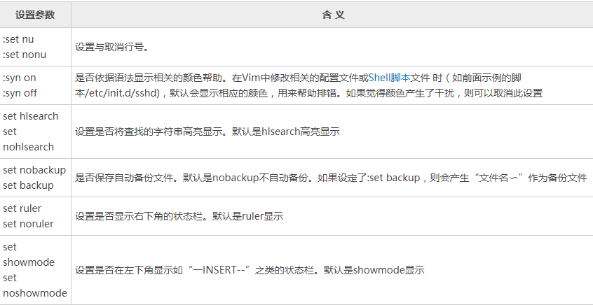

### Normal模式

- u: 撤回
- crlf+r： 前进
- yy: 复制一行
- y:复制多行
  1. 按 `V` 进入可视模式（按大写的 `V` 可以选择整行）。
  2. 使用方向键上下移动选择多行。
  3. 按 `y` 复制选择的文本。
- p: 粘贴
- 替换：:%s/old_text/new_text/g   其中，`%`表示对全局范围内的每一行都进行替换；`old_text`为要被替换的字符串；`new_text`为新的字符串；`g`表示全局替换（可选）。
- vim -c '/关键字' -c 'set hlsearch' filename.txt

