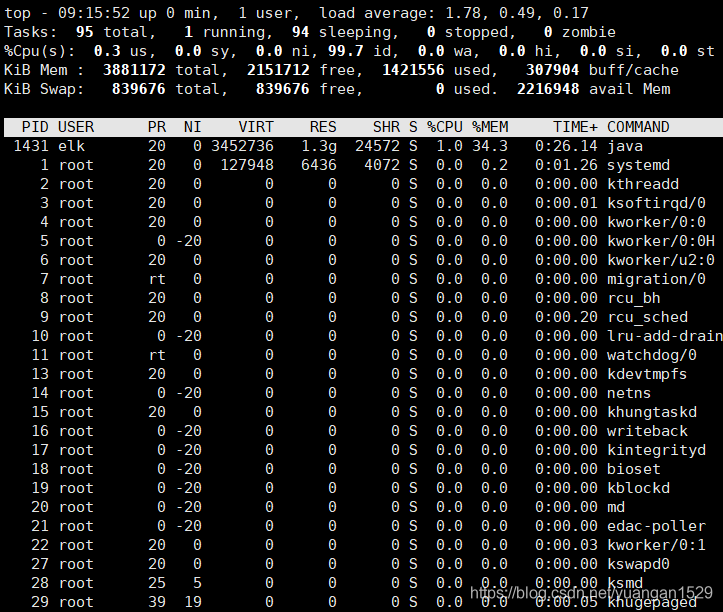
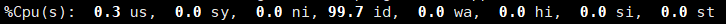
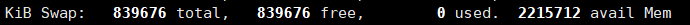
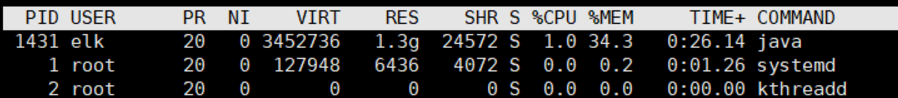
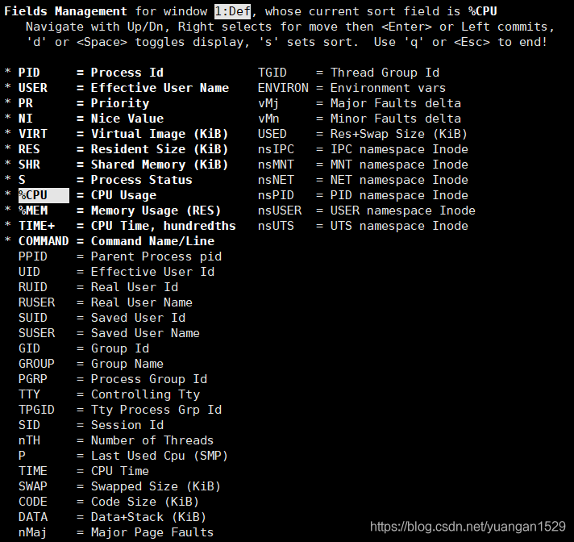
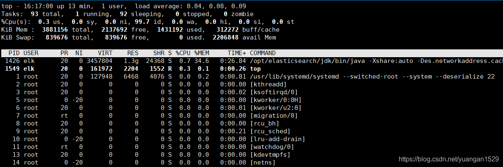
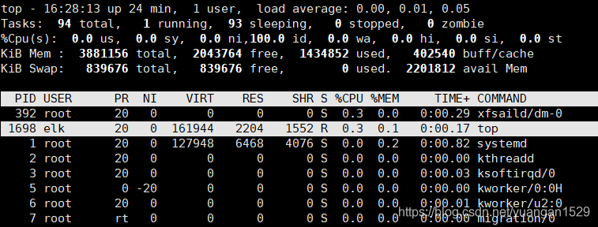
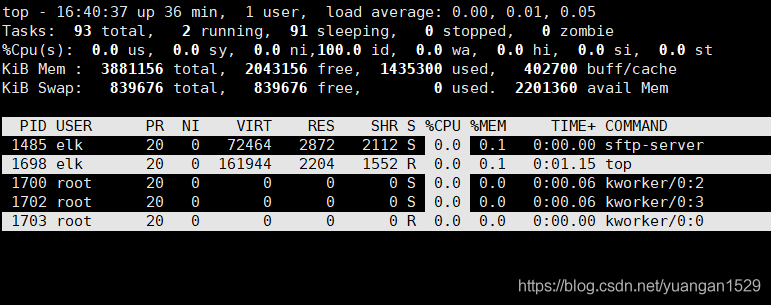

1、top命令简介
top命令是linux系统常用命令之一，能够实时显示系统各个进程的资源占用情况，类似于windows系统的任务管理器。

需要注意的是：top命令监控的最小单位是进程，如果想监控更小单位时，就需要用到ps或者netstate命令来满足我们的要求。

2、top命令界面详解



**第一行：任务队列信息**

系统当前时间：top - 09:15:52
系统运行时间：up 0 min
当前登录用户：1 user
负载均衡情况：load average: 1.78，0.49，0.17（average后面的三个数分别是1分钟、5分钟、15分钟的负载情况。）
注意：load average数据是每隔5秒钟检查一次活跃的进程数，然后按特定算法计算出的数值。如果这个数除以逻辑CPU的数量，结果高于5的时候就表明系统在超负荷运转了

**第二行：Tasks — 任务（进程）**

- 总进程：95 total
- 运行进程：1 running
- 休眠进程：94 sleeping
- 停止进程：0 stopped
- 僵尸进程：0 zombie
- 这里说一下什么是僵尸进程：

我们知道在unix/linux中，正常情况下，子进程是通过父进程创建的，子进程在创建新的进程。子进程的结束和父进程的运行是一个异步过程,即父进程永远无法预测子进程 到底什么时候结束。 当一个进程完成它的工作终止之后，它的父进程需要调用wait()或者waitpid()系统调用取得子进程的终止状态。

孤儿进程：一个父进程退出，而它的一个或多个子进程还在运行，那么那些子进程将成为孤儿进程。孤儿进程将被init进程(进程号为1)所收养，并由init进程对它们完成状态收集工作。
僵尸进程：一个进程使用fork创建子进程，如果子进程退出，而父进程并没有调用wait或waitpid获取子进程的状态信息，那么子进程的进程描述符仍然保存在系统中。这种进程称之为僵死进程。

**第三行：cpu状态信息**




0.3 us：用户空间占用CPU的百分比。
0.0 sy：内核空间占用CPU的百分比。
0.0 ni：改变过优先级的进程占用CPU的百分比
99.7 id：空闲CPU百分比
0.0 wa：IO等待占用CPU的百分比
0.0 hi：硬中断占用CPU的百分比
0.0 si：软中断占用CPU的百分比
0.0 st：当Linux系统是在虚拟机中运行时，等待CPU资源的时间占比
用户空间（User space）与内核空间（Kernel space）：

简单说，Kernel space 是 Linux 内核的运行空间，User space 是用户程序的运行空间。为了安全，它们是隔离的，即使用户的程序崩溃了，内核也不受影响。

Kernel space 可以执行任意命令，调用系统的一切资源；
User space 只能执行简单的运算，不能直接调用系统资源，必须通过系统接口（又称 system call），才能向内核发出指令。

**第四行：内存状态**


KiB Mem：Kib表示描述单位，MEM表示内存

total：总内存量（4G）
free：空闲内存（2G）
used：已用内存（1G）
buff/cache：缓存内存（307M）
**第五行：swap交换分区信息**




KiB Swap：Kib表示描述单位，Swap表示交换分区

total：总内存量（839M）
free：空闲内存（839M）
used：已用内存（0）
avail Mem：可用内存（2G）
什么是交换分区：

类似于Windows的虚拟内存，就是当内存不足的时候，把一部分硬盘空间虚拟成内存使用,从而解决内存容量不足的情况；需要注意的是，存储在交换分区的数据性质，在内存不够的情况下，操作系统先把内存中暂时不用的数据，存到硬盘的交换空间，腾出内存来让别的程序运行

free和avail的区别：

free 是真正尚未被使用的物理内存数量。
available 是应用程序认为可用内存数量，available = free + buffer + cache (注：只是大概的计算方法)
对于内存监控，在top里我们要时刻监控第五行swap交换分区的used，如果这个数值在不断的变化，说明内核在不断进行内存和swap的数据交换，这是真正的内存不够用了。

**第六行：各进程状态监控**



- PID — 进程id

- USER — 进程所有者

- PR — 进程优先级

- NI — nice值。负值表示高优先级，正值表示低优先级

- VIRT — 进程使用的虚拟内存总量，单位kb。VIRT=SWAP+RES

- RES — 进程使用的、未被换出的物理内存大小，单位kb。RES=CODE+DATA

- SHR — 共享内存大小，单位kb

- S — 进程状态。D=不可中断的睡眠状态；R=运行；S=睡眠；T=跟踪/停止；Z=僵尸进程

- %CPU — 上次更新到现在的CPU时间占用百分比

- %MEM — 进程使用的物理内存百分比

- TIME+ — 进程使用的CPU时间总计，单位1/100秒

- COMMAND — 进程名称（命令名/命令行）

  

**3、常用操作命令**

常用命令参数为：

- -c 显示完整的命令路径
- -d <时间> 设置间隔时间
- -u <用户名> 指定用户名
- -p <进程号> 指定进程
- -n <次数> 循环显示的次数常用命令举例：

```she
# 每隔5秒显式所有进程的资源占用情况
top

# 每隔2秒显式所有进程的资源占用情况
top -d 2  

# 显示进程的命令行参数(默认只有进程名)
top -c  

# 每隔5秒显示pid是12345和pid是6789的两个进程的资源占用情况
top -p 12345 -p 6789

# 每隔2秒显示pid是12345的进程的资源使用情况，并显式该进程启动的命令行参数
top -d 2 -c -p 123456 

# 仅显示用户为root的进程
top -u root
```

**4、界面设置**

**4.1 编辑基本视图显示列**
在top基本视图中，敲击f键进入另一个视图，在这里可以编辑基本视图中的显示字段：



用上下键选择选项，按下空格键可以决定是否在基本视图中显示这个选项，按esc键退出编辑界面。

**4.2 显示进程的绝对路径**
在top基本视图中，敲击c键，可以显示进程的路径：



**4.3 杀死某个正在运行的进程**
在top基本视图中，敲击k键，可以在不退出top命令的情况下杀死某个正在运行的进程：


如上图所示，在红框处输入对应的进程号即可。

**4.4 高亮显示当前正在运行的进程**
在top基本视图中，敲击b键，高亮显示当前正在运行的进程：



如上图所示，进程号为1698的进程正在运行，对应最上面第二行显示的当前运行进程为1。

**4.5 多U多核CPU监控**
在top基本视图中，敲击数字1键，可监控每个逻辑CPU的状况，因为我的虚拟机是1核的，这里就不贴图了。

**4.6 显示进程个数**
在top基本视图中，敲击上下键，可以增减显示的进程数目：

