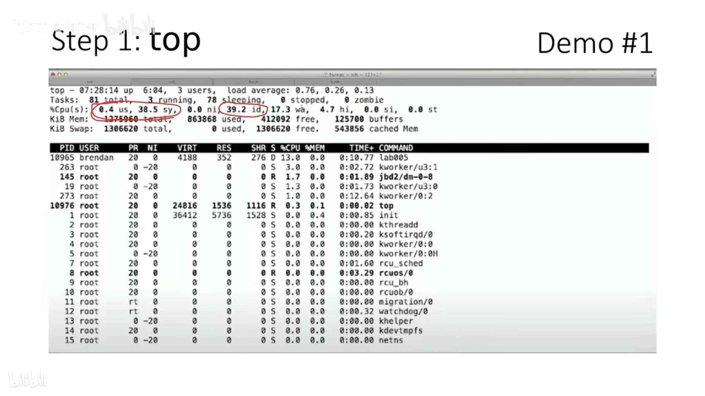
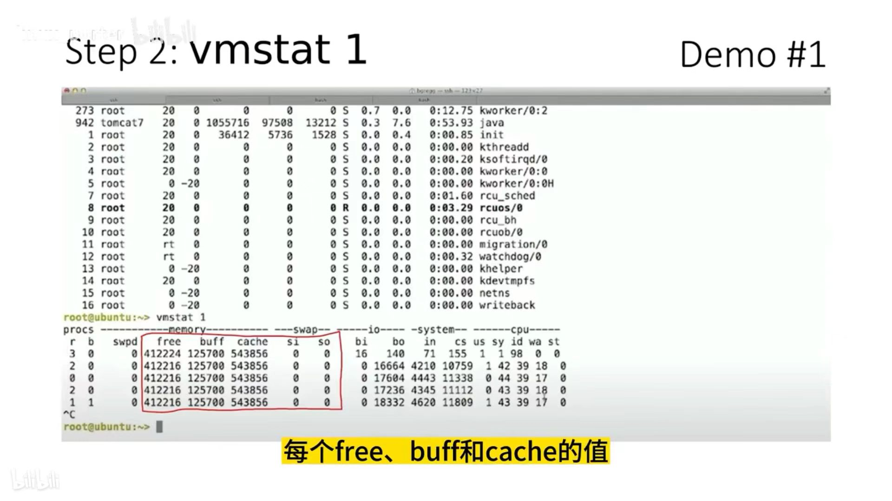
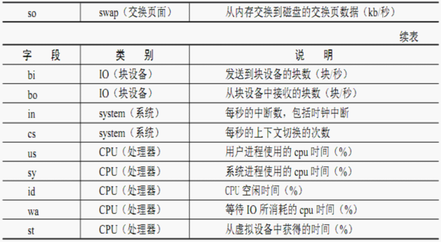
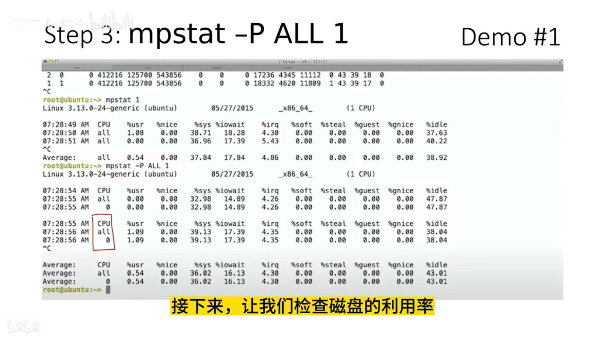
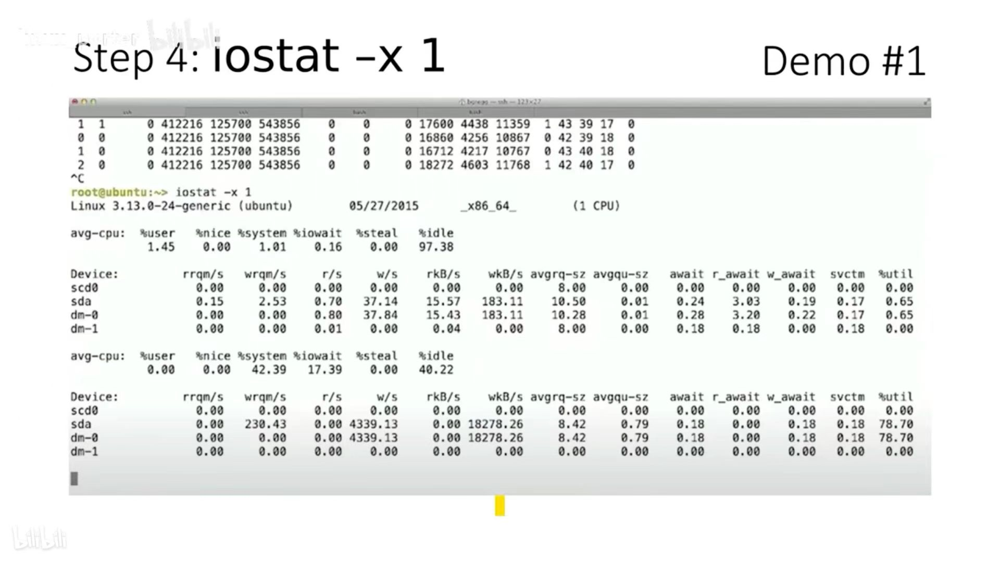
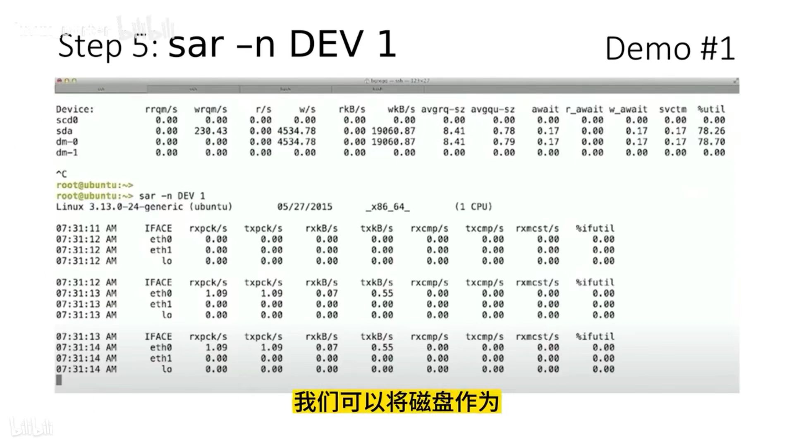
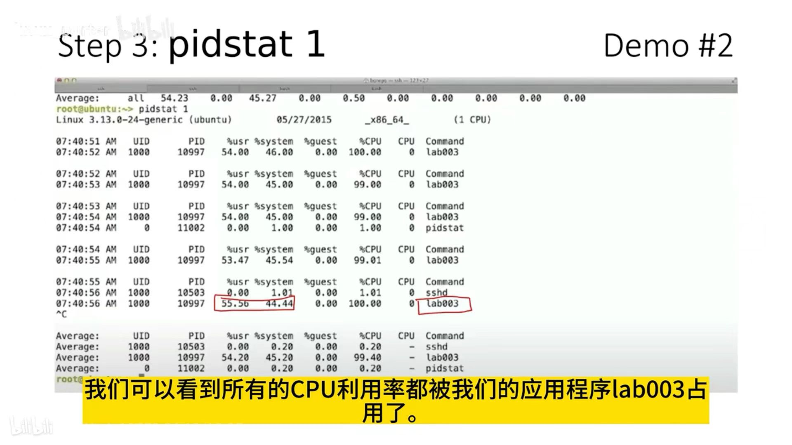
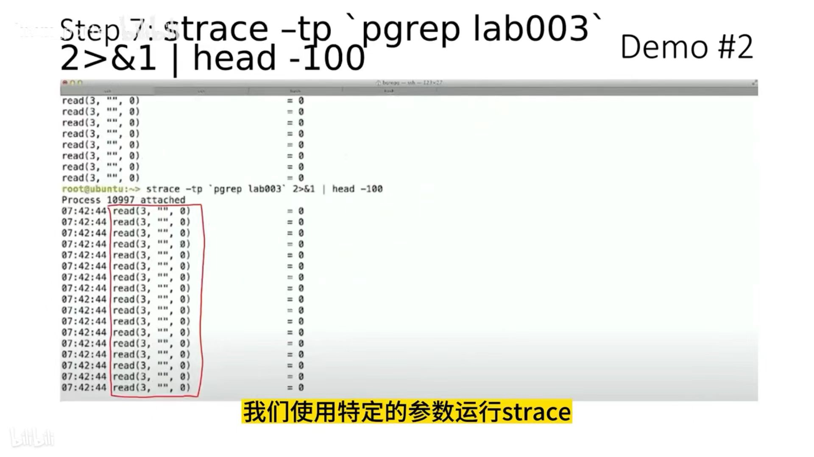
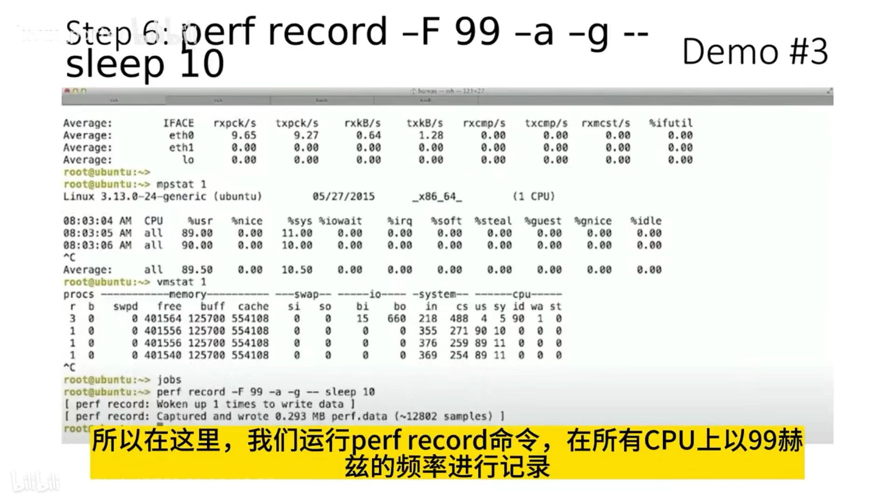

```shell
yum -yinstall sysstat
```

### 1、TOP

查看系统整体信息（短暂的）



### 2、vmstat 

查看服务器关键参数






### 3、mpstat 

查看cpu相关信息

```shell
mpstat -P ALL 1
```



| 参数    | 描述                                       |
| ------- | ------------------------------------------ |
| CPU     | 显示的是某个CPU 还是全部CPU all=全部       |
| %usr    | 表示用户所有使用的CPU百分比                |
| %nice   | 表示使用 nice 值的 CPU 的百分比            |
| %sys    | 表示内核进程使用的 CPU 百分比              |
| %iowait | 表示等待进行 I/O 所使用的 CPU 时间百分比   |
| %irq    | 表示用于处理系统中断的CPU百分比            |
| %soft   | 表示用于软件中断的CPU百分比                |
| %steal  | 虚拟机强制CPU等待的时间百分比              |
| %guest  | 虚拟机占用CPU时间的百分比                  |
| %gnice  | CPU运行niced guest虚拟机所花费的时间百分比 |
| %idle   | CPU的空闲时间的百分比                      |


注： mpstat主要用在当系统变慢，平均负载增大时，我们想判断到底是CPU的使用率增大了，还是IO压力增大的情况

### 4、iostat 

查看io相关信息

```shell
iostat -x 1
```



### 5、sar

查看网络相关信息

```shell
sar -n DEV 1
```



### 6、pidstat

查看进程的相关信息

```shell
pidstat 1
```



### 7、strace

追踪进程信息

```shell
strace -tp `pgrep xxx` 2 > &1 | head -100
```



### 8、perf （atop snoop）

查看cpu相关信息（持续信息）

```shell
perf record -F 99 -a -g --sleep 10
```

